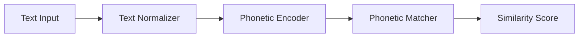

# Contributing Guidelines

## Overview

Thank you for your interest in contributing to the File Processing Optimization system! This document provides guidelines for contributing code, documentation, and other improvements to the project.

## Table of Contents

- [Code of Conduct](#code-of-conduct)
- [Getting Started](#getting-started)
- [Development Setup](#development-setup)
- [Coding Standards](#coding-standards)
- [Testing Guidelines](#testing-guidelines)
- [Submission Process](#submission-process)
- [Review Process](#review-process)
- [Documentation](#documentation)
- [Issue Reporting](#issue-reporting)

## Code of Conduct

### Our Pledge

We are committed to providing a welcoming and inclusive environment for all contributors, regardless of background, experience level, or identity.

### Expected Behavior

- Use welcoming and inclusive language
- Be respectful of differing viewpoints and experiences
- Gracefully accept constructive criticism
- Focus on what is best for the community
- Show empathy towards other community members

### Unacceptable Behavior

- Harassment, discrimination, or offensive comments
- Personal attacks or trolling
- Publishing private information without permission
- Any conduct that would be inappropriate in a professional setting

## Getting Started

### Prerequisites

Before contributing, ensure you have:

- Python 3.8 or higher
- Git version control
- Basic understanding of the project architecture
- Familiarity with clean architecture principles

### First-Time Contributors

1. **Read the Documentation**
   - Review the README.md
   - Study the architecture documentation
   - Understand the project structure

2. **Set Up Development Environment**
   - Follow the development setup instructions
   - Run the test suite to ensure everything works
   - Try the example workflows

3. **Find an Issue**
   - Look for issues labeled "good first issue"
   - Check the project roadmap for feature requests
   - Ask maintainers for guidance on where to start

## Development Setup

### 1. Fork and Clone

```bash
# Fork the repository on GitHub
# Then clone your fork
git clone https://github.com/YOUR_USERNAME/file-processing-optimization.git
cd file-processing-optimization

# Add upstream remote
git remote add upstream https://github.com/ORIGINAL_OWNER/file-processing-optimization.git
```

### 2. Environment Setup

```bash
# Create virtual environment
python -m venv venv
source venv/bin/activate  # On Windows: venv\Scripts\activate

# Install development dependencies
pip install -e ".[dev]"

# Install pre-commit hooks
pre-commit install
```

### 3. Verify Setup

```bash
# Run tests
pytest

# Run linting
flake8 src/ tests/
black --check src/ tests/
mypy src/

# Start development server
python -m src.web.api_app
```

## Coding Standards

### 1. Python Style Guide

We follow PEP 8 with some modifications:

**Formatting:**
- Line length: 88 characters (Black default)
- Use double quotes for strings
- Use trailing commas in multi-line structures

**Naming Conventions:**
```python
# Variables and functions: snake_case
user_name = "john_doe"
def calculate_similarity(text1: str, text2: str) -> float:
    pass

# Classes: PascalCase
class MatchingEngine:
    pass

# Constants: UPPER_SNAKE_CASE
MAX_FILE_SIZE_MB = 100

# Private methods: leading underscore
def _internal_method(self):
    pass
```

### 2. Type Hints

All public functions and methods must include type hints:

```python
from typing import List, Dict, Optional, Union
from dataclasses import dataclass

@dataclass
class MatchingResult:
    matched_records: List[MatchedRecord]
    confidence_scores: Dict[str, float]
    metadata: Optional[Dict[str, Any]] = None

def process_files(
    file1_path: str,
    file2_path: str,
    config: MatchingConfig
) -> MatchingResult:
    """Process two files and return matching results."""
    pass
```

### 3. Documentation Standards

**Docstring Format:**
```python
def calculate_fuzzy_similarity(text1: str, text2: str, threshold: float = 0.8) -> float:
    """Calculate fuzzy similarity between two text strings.
    
    Uses the Levenshtein distance algorithm to compute similarity scores
    with optimizations for Uzbek text processing.
    
    Args:
        text1: First text string to compare
        text2: Second text string to compare  
        threshold: Minimum similarity threshold (default: 0.8)
        
    Returns:
        Similarity score between 0.0 and 1.0
        
    Raises:
        ValueError: If threshold is not between 0.0 and 1.0
        
    Example:
        >>> calculate_fuzzy_similarity("hello", "helo")
        0.8
        >>> calculate_fuzzy_similarity("completely", "different")
        0.1
    """
    if not 0.0 <= threshold <= 1.0:
        raise ValueError("Threshold must be between 0.0 and 1.0")
    
    # Implementation here
    pass
```

### 4. Error Handling

**Exception Hierarchy:**
```python
# Use specific exception types
class FileProcessingError(Exception):
    """Base exception for file processing errors."""
    pass

class FileValidationError(FileProcessingError):
    """Raised when file validation fails."""
    
    def __init__(self, message: str, file_path: str, line_number: Optional[int] = None):
        super().__init__(message)
        self.file_path = file_path
        self.line_number = line_number
```

**Error Context:**
```python
import logging
from contextlib import contextmanager

logger = logging.getLogger(__name__)

@contextmanager
def error_context(operation: str, **context):
    """Provide error context for operations."""
    try:
        yield
    except Exception as e:
        logger.error(
            f"Operation failed: {operation}",
            extra={
                "error": str(e),
                "operation": operation,
                **context
            }
        )
        raise
```

### 5. Clean Architecture Principles

**Layer Separation:**
```python
# Domain layer - no external dependencies
class MatchingEngine:
    def __init__(self, algorithms: List[MatchingAlgorithm]):
        self._algorithms = algorithms
    
    def find_matches(self, dataset1: Dataset, dataset2: Dataset) -> MatchingResult:
        # Pure business logic
        pass

# Application layer - orchestrates domain objects
class FileProcessingService:
    def __init__(self, engine: MatchingEngine, repository: FileRepository):
        self._engine = engine
        self._repository = repository
    
    def process_files(self, file1_path: str, file2_path: str) -> MatchingResult:
        # Orchestration logic
        pass

# Infrastructure layer - external concerns
class CSVFileRepository(FileRepository):
    def load_file(self, path: str) -> Dataset:
        # File I/O implementation
        pass
```

## Testing Guidelines

### 1. Test Structure

Follow the test pyramid with emphasis on unit tests:

```
tests/
├── unit/                   # 70% of tests
│   ├── domain/
│   ├── application/
│   └── infrastructure/
├── integration/            # 20% of tests
│   ├── api/
│   ├── database/
│   └── file_processing/
└── e2e/                   # 10% of tests
    ├── web_interface/
    └── cli/
```

### 2. Unit Test Examples

```python
import pytest
from unittest.mock import Mock, patch
from src.domain.matching.fuzzy_matcher import FuzzyMatcher

class TestFuzzyMatcher:
    """Test suite for FuzzyMatcher class."""
    
    def setup_method(self):
        """Set up test fixtures."""
        self.matcher = FuzzyMatcher(threshold=0.8)
    
    def test_exact_match_returns_perfect_score(self):
        """Test that identical strings return score of 1.0."""
        # Arrange
        text1 = "hello world"
        text2 = "hello world"
        
        # Act
        score = self.matcher.calculate_similarity(text1, text2)
        
        # Assert
        assert score == 1.0
    
    def test_completely_different_strings_return_low_score(self):
        """Test that completely different strings return low scores."""
        # Arrange
        text1 = "hello"
        text2 = "xyz123"
        
        # Act
        score = self.matcher.calculate_similarity(text1, text2)
        
        # Assert
        assert score < 0.3
    
    @pytest.mark.parametrize("text1,text2,expected_min", [
        ("hello", "helo", 0.8),
        ("world", "wrold", 0.8),
        ("test", "tset", 0.7),
    ])
    def test_similar_strings_return_high_scores(self, text1, text2, expected_min):
        """Test that similar strings return appropriately high scores."""
        score = self.matcher.calculate_similarity(text1, text2)
        assert score >= expected_min
    
    def test_empty_strings_raise_value_error(self):
        """Test that empty strings raise appropriate errors."""
        with pytest.raises(ValueError, match="Empty strings not allowed"):
            self.matcher.calculate_similarity("", "test")
    
    @patch('src.domain.matching.fuzzy_matcher.fuzz')
    def test_uses_rapidfuzz_library(self, mock_fuzz):
        """Test that the matcher uses the rapidfuzz library."""
        # Arrange
        mock_fuzz.ratio.return_value = 85
        
        # Act
        score = self.matcher.calculate_similarity("test1", "test2")
        
        # Assert
        mock_fuzz.ratio.assert_called_once_with("test1", "test2")
        assert score == 0.85
```

### 3. Integration Test Examples

```python
import pytest
import tempfile
import os
from src.application.services.file_service import FileProcessingService
from src.infrastructure.file_repository import CSVFileRepository

class TestFileProcessingIntegration:
    """Integration tests for file processing workflow."""
    
    def setup_method(self):
        """Set up test environment."""
        self.temp_dir = tempfile.mkdtemp()
        self.repository = CSVFileRepository()
        self.service = FileProcessingService(repository=self.repository)
    
    def teardown_method(self):
        """Clean up test environment."""
        import shutil
        shutil.rmtree(self.temp_dir)
    
    def test_end_to_end_csv_processing(self):
        """Test complete CSV file processing workflow."""
        # Arrange
        file1_path = os.path.join(self.temp_dir, "file1.csv")
        file2_path = os.path.join(self.temp_dir, "file2.csv")
        
        with open(file1_path, 'w') as f:
            f.write("name,age\nJohn,25\nJane,30\n")
        
        with open(file2_path, 'w') as f:
            f.write("full_name,email\nJohn Smith,john@example.com\nJane Doe,jane@example.com\n")
        
        # Act
        result = self.service.process_files(file1_path, file2_path)
        
        # Assert
        assert len(result.matched_records) > 0
        assert all(record.confidence_score > 0.5 for record in result.matched_records)
```

### 4. Test Data Management

```python
# tests/fixtures/test_data.py
import pytest
import pandas as pd

@pytest.fixture
def sample_csv_data():
    """Provide sample CSV data for testing."""
    return pd.DataFrame({
        'name': ['John Smith', 'Jane Doe', 'Bob Johnson'],
        'age': [25, 30, 35],
        'city': ['New York', 'Los Angeles', 'Chicago']
    })

@pytest.fixture
def uzbek_text_samples():
    """Provide Uzbek text samples for testing."""
    return [
        ('Toshkent', 'Ташкент'),  # Latin/Cyrillic variants
        ('Samarqand', 'Самарқанд'),
        ('Buxoro', 'Бухоро')
    ]

# Use fixtures in tests
def test_uzbek_normalization(uzbek_text_samples):
    """Test Uzbek text normalization."""
    for latin, cyrillic in uzbek_text_samples:
        normalized_latin = normalize_uzbek_text(latin)
        normalized_cyrillic = normalize_uzbek_text(cyrillic)
        assert normalized_latin == normalized_cyrillic
```

### 5. Performance Testing

```python
import pytest
import time
from memory_profiler import profile

class TestPerformance:
    """Performance tests for critical operations."""
    
    @pytest.mark.performance
    def test_large_dataset_processing_time(self):
        """Test that large datasets process within acceptable time."""
        # Arrange
        large_dataset = generate_test_dataset(size=10000)
        start_time = time.time()
        
        # Act
        result = process_dataset(large_dataset)
        
        # Assert
        processing_time = time.time() - start_time
        assert processing_time < 60  # Should complete within 1 minute
        assert len(result.matched_records) > 0
    
    @profile
    def test_memory_usage_stays_within_limits(self):
        """Test that memory usage stays within acceptable limits."""
        # This test uses memory_profiler to track memory usage
        large_dataset = generate_test_dataset(size=50000)
        result = process_dataset(large_dataset)
        # Memory usage will be reported by @profile decorator
```

## Submission Process

### 1. Branch Strategy

```bash
# Create feature branch
git checkout -b feature/add-phonetic-matching

# Or bug fix branch
git checkout -b fix/memory-leak-in-processing

# Or documentation branch
git checkout -b docs/update-api-documentation
```

### 2. Commit Guidelines

**Commit Message Format:**
```
<type>(<scope>): <subject>

<body>

<footer>
```

**Types:**
- `feat`: New feature
- `fix`: Bug fix
- `docs`: Documentation changes
- `style`: Code style changes (formatting, etc.)
- `refactor`: Code refactoring
- `test`: Adding or updating tests
- `chore`: Maintenance tasks

**Examples:**
```bash
git commit -m "feat(matching): add phonetic matching algorithm

Implement phonetic matching using Soundex algorithm with
optimizations for Uzbek language characteristics.

Closes #123"

git commit -m "fix(api): resolve memory leak in file upload

Fixed memory leak caused by unclosed file handles in
the upload endpoint. Added proper context managers.

Fixes #456"

git commit -m "docs(api): update authentication examples

Added examples for JWT token usage and refresh token
workflow in the API documentation.

Related to #789"
```

### 3. Pre-submission Checklist

Before submitting a pull request:

- [ ] Code follows style guidelines
- [ ] All tests pass locally
- [ ] New tests added for new functionality
- [ ] Documentation updated if needed
- [ ] Type hints added to new functions
- [ ] No sensitive information in commits
- [ ] Commit messages follow guidelines
- [ ] Branch is up to date with main

```bash
# Run pre-submission checks
pytest                          # Run all tests
flake8 src/ tests/             # Check code style
black --check src/ tests/      # Check formatting
mypy src/                      # Check type hints
pre-commit run --all-files     # Run all pre-commit hooks
```

### 4. Pull Request Process

**Pull Request Template:**
```markdown
## Description
Brief description of changes made.

## Type of Change
- [ ] Bug fix (non-breaking change that fixes an issue)
- [ ] New feature (non-breaking change that adds functionality)
- [ ] Breaking change (fix or feature that would cause existing functionality to not work as expected)
- [ ] Documentation update

## Testing
- [ ] Unit tests added/updated
- [ ] Integration tests added/updated
- [ ] Manual testing completed

## Checklist
- [ ] Code follows style guidelines
- [ ] Self-review completed
- [ ] Documentation updated
- [ ] No breaking changes (or breaking changes documented)

## Related Issues
Closes #123
Related to #456
```

## Review Process

### 1. Code Review Guidelines

**For Reviewers:**
- Focus on code correctness and maintainability
- Check for security vulnerabilities
- Verify test coverage
- Ensure documentation is adequate
- Be constructive and respectful in feedback

**For Authors:**
- Respond to feedback promptly
- Make requested changes or explain why not
- Keep discussions focused on the code
- Be open to suggestions and improvements

### 2. Review Criteria

**Code Quality:**
- Follows coding standards
- Proper error handling
- Appropriate abstractions
- No code duplication

**Testing:**
- Adequate test coverage
- Tests are meaningful and maintainable
- Edge cases covered
- Performance considerations addressed

**Documentation:**
- Public APIs documented
- Complex logic explained
- README updated if needed
- Architecture decisions documented

### 3. Approval Process

1. **Automated Checks**: All CI checks must pass
2. **Peer Review**: At least one maintainer approval required
3. **Testing**: Manual testing for significant changes
4. **Documentation**: Documentation review for user-facing changes

## Documentation

### 1. Code Documentation

**Inline Comments:**
```python
# Use comments to explain WHY, not WHAT
def calculate_blocking_key(text: str) -> str:
    # Use first 3 characters for blocking to reduce comparison space
    # This optimization reduces O(n²) complexity to approximately O(n)
    return text[:3].lower()
```

**Module Documentation:**
```python
"""
File processing utilities for the matching system.

This module provides utilities for loading, validating, and processing
various file formats including CSV, JSON, and Excel files. It implements
streaming processing for memory efficiency with large datasets.

Example:
    >>> from src.infrastructure.file_processing import FileProcessor
    >>> processor = FileProcessor()
    >>> dataset = processor.load_csv('data.csv')
    >>> print(f"Loaded {len(dataset)} records")

Note:
    All file operations use UTF-8 encoding by default. For other encodings,
    specify the encoding parameter explicitly.
"""
```

### 2. API Documentation

Use OpenAPI/Swagger specifications:

```python
from flask_restx import Resource, fields, Namespace

api = Namespace('files', description='File processing operations')

upload_model = api.model('FileUpload', {
    'file1': fields.Raw(required=True, description='First file to process'),
    'file2': fields.Raw(required=True, description='Second file to process')
})

@api.route('/upload')
class FileUpload(Resource):
    @api.expect(upload_model)
    @api.doc('upload_files')
    @api.response(200, 'Files uploaded successfully')
    @api.response(400, 'Invalid file format')
    @api.response(413, 'File too large')
    def post(self):
        """Upload two files for processing."""
        pass
```

### 3. Architecture Documentation

Update architecture documentation for significant changes:

```markdown
## New Component: Phonetic Matching Engine

### Overview
The phonetic matching engine provides sound-based matching capabilities
optimized for Uzbek language characteristics.

### Architecture


### Integration
The phonetic matcher integrates with the existing matching pipeline
as an additional algorithm option.
```

## Issue Reporting

### 1. Bug Reports

Use the bug report template:

```markdown
**Bug Description**
A clear description of what the bug is.

**To Reproduce**
Steps to reproduce the behavior:
1. Go to '...'
2. Click on '....'
3. Scroll down to '....'
4. See error

**Expected Behavior**
A clear description of what you expected to happen.

**Screenshots**
If applicable, add screenshots to help explain your problem.

**Environment:**
- OS: [e.g. Ubuntu 20.04]
- Python Version: [e.g. 3.9.7]
- Package Version: [e.g. 1.2.3]

**Additional Context**
Add any other context about the problem here.
```

### 2. Feature Requests

Use the feature request template:

```markdown
**Is your feature request related to a problem?**
A clear description of what the problem is.

**Describe the solution you'd like**
A clear description of what you want to happen.

**Describe alternatives you've considered**
A clear description of any alternative solutions.

**Additional context**
Add any other context or screenshots about the feature request.
```

### 3. Security Issues

For security vulnerabilities:
- Do NOT create public issues
- Email security@example.com directly
- Include detailed reproduction steps
- Allow reasonable time for response

## Recognition

### Contributors

We recognize contributors in several ways:

- **Contributors.md**: All contributors listed
- **Release Notes**: Significant contributions highlighted
- **GitHub Releases**: Contributors tagged in releases
- **Documentation**: Author attribution for major features

### Contribution Types

We value all types of contributions:

- **Code**: New features, bug fixes, optimizations
- **Documentation**: Guides, API docs, examples
- **Testing**: Test cases, performance testing, QA
- **Design**: UI/UX improvements, architecture design
- **Community**: Issue triage, user support, mentoring

## Resources

### Learning Resources

- [Clean Architecture Principles](https://blog.cleancoder.com/uncle-bob/2012/08/13/the-clean-architecture.html)
- [Python Type Hints](https://docs.python.org/3/library/typing.html)
- [Testing Best Practices](https://docs.pytest.org/en/stable/goodpractices.html)
- [Git Workflow](https://www.atlassian.com/git/tutorials/comparing-workflows)

### Development Tools

- **IDE**: PyCharm, VS Code, or similar
- **Linting**: flake8, black, mypy
- **Testing**: pytest, coverage
- **Documentation**: Sphinx, MkDocs
- **Profiling**: cProfile, memory_profiler

### Communication

- **GitHub Issues**: Bug reports, feature requests
- **GitHub Discussions**: General questions, ideas
- **Email**: security@example.com (security issues only)
- **Documentation**: This repository's docs/ folder

Thank you for contributing to the File Processing Optimization system! Your contributions help make this project better for everyone.