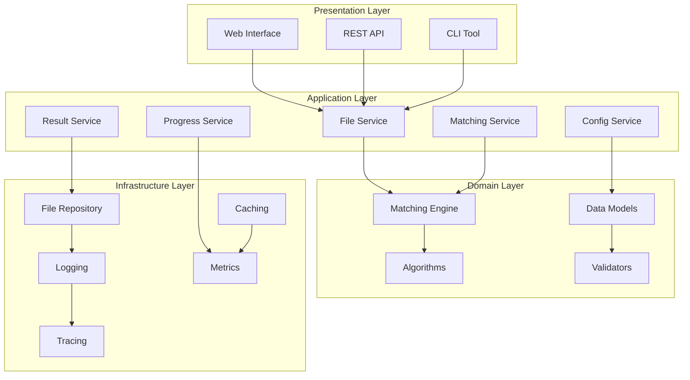
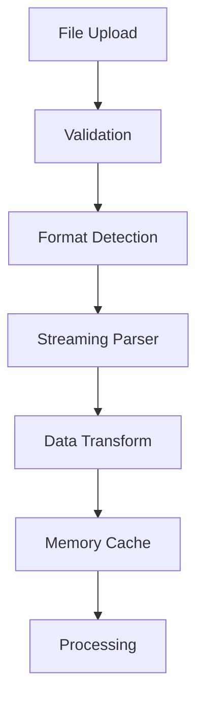
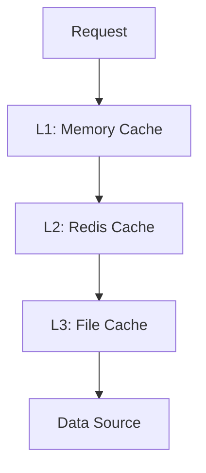
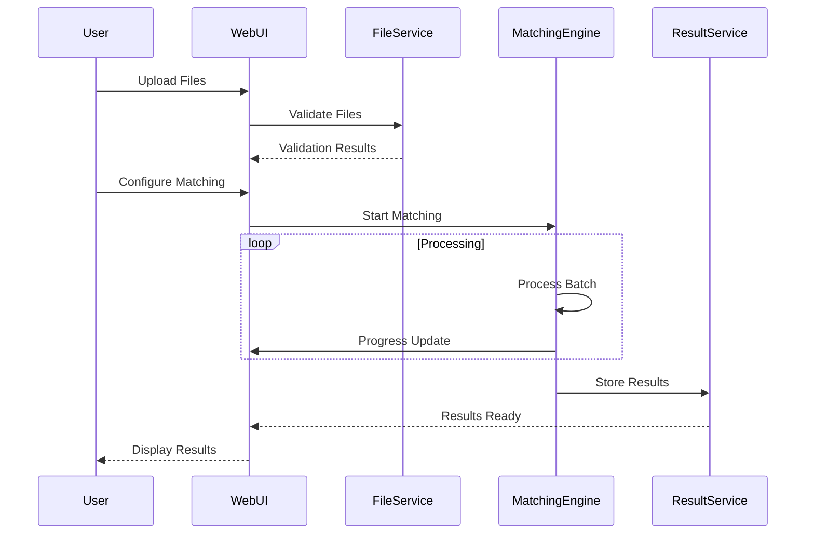
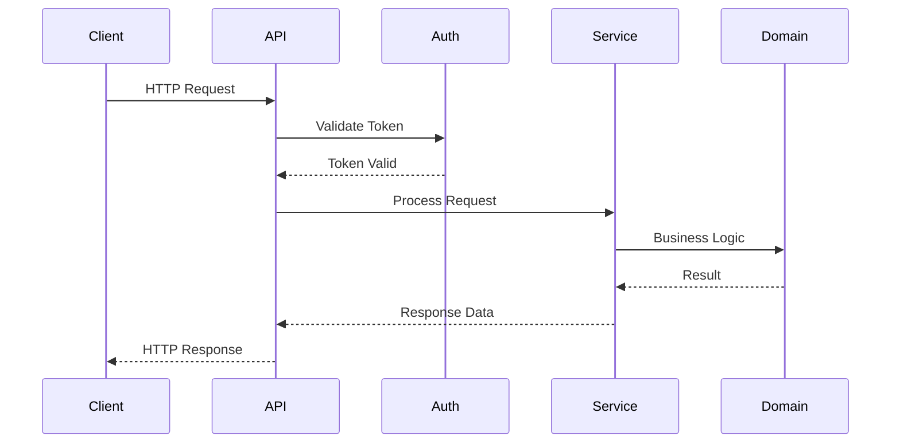
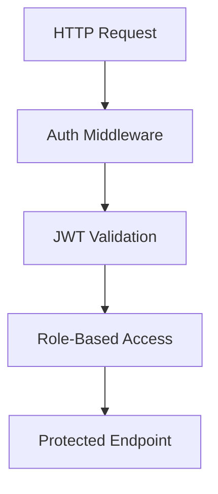
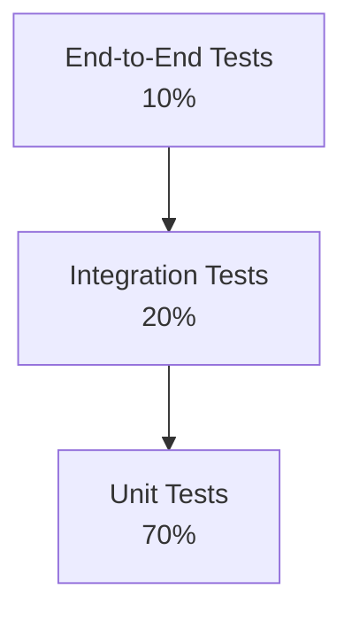

# Architecture Documentation

## Overview

The File Processing Optimization system is built using clean architecture principles with clear separation of concerns across multiple layers. This document provides a comprehensive overview of the system architecture, design decisions, and implementation patterns.

## System Architecture

### High-Level Architecture



### Layer Responsibilities

#### 1. Presentation Layer
- **Web Interface**: Flask-based web application with modern UI
- **REST API**: RESTful endpoints for programmatic access
- **CLI Tool**: Command-line interface for batch processing

#### 2. Application Layer
- **File Service**: Handles file I/O, validation, and format conversion
- **Matching Service**: Orchestrates matching operations
- **Config Service**: Manages application configuration
- **Progress Service**: Tracks and reports operation progress
- **Result Service**: Manages result storage and export

#### 3. Domain Layer
- **Matching Engine**: Core business logic for data matching
- **Data Models**: Domain entities and value objects
- **Algorithms**: Matching algorithm implementations
- **Validators**: Business rule validation

#### 4. Infrastructure Layer
- **File Repository**: File system abstraction
- **Logging**: Structured logging with correlation IDs
- **Caching**: Performance optimization caching
- **Metrics**: Application metrics collection
- **Tracing**: Distributed tracing support

## Design Patterns

### 1. Clean Architecture
The system follows Uncle Bob's Clean Architecture principles:
- **Dependency Inversion**: High-level modules don't depend on low-level modules
- **Single Responsibility**: Each module has one reason to change
- **Open/Closed**: Open for extension, closed for modification
- **Interface Segregation**: Clients depend only on interfaces they use

### 2. Repository Pattern
File operations are abstracted through repository interfaces:
```python
class FileRepository(ABC):
    @abstractmethod
    def load_file(self, path: str) -> Dataset:
        pass
    
    @abstractmethod
    def save_file(self, data: Dataset, path: str) -> None:
        pass
```

### 3. Strategy Pattern
Matching algorithms are implemented as pluggable strategies:
```python
class MatchingAlgorithm(ABC):
    @abstractmethod
    def calculate_similarity(self, text1: str, text2: str) -> float:
        pass

class FuzzyMatcher(MatchingAlgorithm):
    def calculate_similarity(self, text1: str, text2: str) -> float:
        return fuzz.ratio(text1, text2) / 100.0
```

### 4. Observer Pattern
Progress tracking uses observer pattern for real-time updates:
```python
class ProgressTracker:
    def __init__(self):
        self._observers: List[ProgressObserver] = []
    
    def attach(self, observer: ProgressObserver):
        self._observers.append(observer)
    
    def notify(self, progress: ProgressUpdate):
        for observer in self._observers:
            observer.update(progress)
```

### 5. Factory Pattern
Configuration objects are created using factory pattern:
```python
class ConfigurationFactory:
    @staticmethod
    def create_matching_config(config_dict: Dict) -> MatchingConfig:
        return MatchingConfig(
            mappings=[FieldMapping(**m) for m in config_dict['mappings']],
            algorithms=[AlgorithmConfig(**a) for a in config_dict['algorithms']],
            thresholds=config_dict['thresholds']
        )
```

## Component Design

### 1. Matching Engine

The core matching engine implements a pipeline architecture:


**Key Components:**
- **Normalizer**: Text preprocessing and standardization
- **Blocker**: Reduces comparison space using indexing
- **Matcher**: Applies matching algorithms
- **Scorer**: Calculates confidence scores
- **Filter**: Applies thresholds and business rules

### 2. File Processing Pipeline

File processing follows a streaming architecture for memory efficiency:



**Key Features:**
- **Streaming Processing**: Handles large files without loading entirely into memory
- **Format Detection**: Automatic detection of CSV delimiters and JSON structure
- **Validation**: Schema validation and data quality checks
- **Transformation**: Data type conversion and normalization

### 3. Caching Strategy

Multi-level caching improves performance:



**Cache Levels:**
- **L1 (Memory)**: LRU cache for frequently accessed data
- **L2 (Redis)**: Distributed cache for shared data
- **L3 (File)**: Persistent cache for expensive computations

## Data Flow

### 1. File Processing Flow



### 2. API Request Flow



## Performance Considerations

### 1. Memory Management

**Streaming Processing:**
- Files are processed in chunks to avoid memory overflow
- Lazy evaluation prevents unnecessary data loading
- Memory-mapped files for very large datasets

**Memory Monitoring:**
```python
class MemoryManager:
    def __init__(self, max_memory_mb: int = 2048):
        self.max_memory = max_memory_mb * 1024 * 1024
    
    def check_memory_usage(self):
        current = psutil.Process().memory_info().rss
        if current > self.max_memory:
            raise MemoryError(f"Memory usage {current} exceeds limit {self.max_memory}")
```

### 2. CPU Optimization

**Parallel Processing:**
- Multi-processing for CPU-intensive matching operations
- Thread pools for I/O operations
- Async processing for web requests

**Algorithm Optimization:**
- Blocking strategies reduce comparison complexity from O(n²) to O(n)
- Caching eliminates redundant calculations
- Early termination for low-confidence matches

### 3. I/O Optimization

**File Operations:**
- Buffered reading/writing
- Compression for large outputs
- Parallel file processing

**Network Operations:**
- Connection pooling
- Request batching
- Async HTTP clients

## Security Architecture

### 1. Authentication & Authorization



**Security Layers:**
- **JWT Authentication**: Stateless token-based authentication
- **Role-Based Access Control**: Fine-grained permissions
- **Rate Limiting**: Protection against abuse
- **Input Validation**: Prevents injection attacks

### 2. Data Protection

**File Security:**
- Secure temporary file storage with encryption
- Automatic cleanup of sensitive data
- File type validation and content scanning
- Virus scanning integration

**Data Privacy:**
- PII detection and masking
- Configurable anonymization rules
- Audit logging for data access
- Secure data disposal

## Monitoring & Observability

### 1. Metrics Collection


**Metric Types:**
- **Business Metrics**: Matching accuracy, throughput
- **Application Metrics**: Response times, error rates
- **Infrastructure Metrics**: CPU, memory, disk usage
- **Custom Metrics**: Algorithm performance, cache hit rates

### 2. Logging Strategy

**Structured Logging:**
```python
logger.info(
    "Processing started",
    extra={
        "correlation_id": "uuid-here",
        "operation": "file_matching",
        "file1_size": 1000,
        "file2_size": 2000,
        "user_id": "user123"
    }
)
```

**Log Levels:**
- **DEBUG**: Detailed diagnostic information
- **INFO**: General operational messages
- **WARNING**: Potential issues that don't affect functionality
- **ERROR**: Error conditions that affect functionality
- **CRITICAL**: Serious errors that may cause system failure

### 3. Distributed Tracing

Request tracing across components:
```python
@trace_operation("file_processing")
def process_files(file1_path: str, file2_path: str):
    with tracer.start_span("load_files") as span:
        dataset1 = load_file(file1_path)
        dataset2 = load_file(file2_path)
        span.set_attribute("file1_rows", len(dataset1))
        span.set_attribute("file2_rows", len(dataset2))
    
    with tracer.start_span("matching") as span:
        results = match_datasets(dataset1, dataset2)
        span.set_attribute("matches_found", len(results.matched))
```

## Error Handling Strategy

### 1. Exception Hierarchy

```python
class FileProcessingError(Exception):
    """Base exception for file processing errors"""
    pass

class FileValidationError(FileProcessingError):
    """File validation failed"""
    pass

class MatchingError(Exception):
    """Base exception for matching operations"""
    pass

class ConfigurationError(Exception):
    """Configuration validation failed"""
    pass
```

### 2. Error Recovery

**Retry Mechanisms:**
- Exponential backoff for transient failures
- Circuit breaker pattern for external services
- Graceful degradation for non-critical features

**Error Context:**
```python
try:
    result = process_file(file_path)
except FileProcessingError as e:
    logger.error(
        "File processing failed",
        extra={
            "error": str(e),
            "file_path": file_path,
            "file_size": os.path.getsize(file_path),
            "stack_trace": traceback.format_exc()
        }
    )
    raise
```

## Deployment Architecture

### 1. Container Strategy

**Multi-stage Docker Build:**
```dockerfile
# Build stage
FROM python:3.11-slim as builder
COPY requirements.txt .
RUN pip install --user -r requirements.txt

# Runtime stage
FROM python:3.11-slim
COPY --from=builder /root/.local /root/.local
COPY src/ /app/src/
WORKDIR /app
CMD ["python", "-m", "src.web.api_app"]
```

### 2. Kubernetes Deployment

**Deployment Strategy:**
- Rolling updates with zero downtime
- Horizontal pod autoscaling based on CPU/memory
- Health checks and readiness probes
- ConfigMaps for environment-specific settings

**Resource Management:**
```yaml
resources:
  requests:
    memory: "512Mi"
    cpu: "250m"
  limits:
    memory: "2Gi"
    cpu: "1000m"
```

### 3. Service Mesh

**Istio Integration:**
- Traffic management and load balancing
- Security policies and mTLS
- Observability and distributed tracing
- Circuit breaking and fault injection

## Testing Strategy

### 1. Test Pyramid



### 2. Test Categories

**Unit Tests:**
- Algorithm correctness
- Data model validation
- Configuration parsing
- Error handling

**Integration Tests:**
- API endpoint testing
- Database integration
- File processing workflows
- External service integration

**Performance Tests:**
- Load testing with various dataset sizes
- Memory usage profiling
- Concurrent operation testing
- Scalability validation

## Future Considerations

### 1. Scalability Enhancements

**Horizontal Scaling:**
- Microservices decomposition
- Event-driven architecture
- Message queue integration
- Distributed processing

**Performance Optimization:**
- GPU acceleration for fuzzy matching
- Machine learning for match prediction
- Advanced caching strategies
- Database optimization

### 2. Feature Extensions

**Advanced Matching:**
- Machine learning-based matching
- Multi-language support
- Custom algorithm plugins
- Real-time streaming processing

**Integration Capabilities:**
- Webhook notifications
- External system connectors
- Batch processing APIs
- Cloud storage integration

This architecture provides a solid foundation for a scalable, maintainable, and performant file processing system while maintaining flexibility for future enhancements.